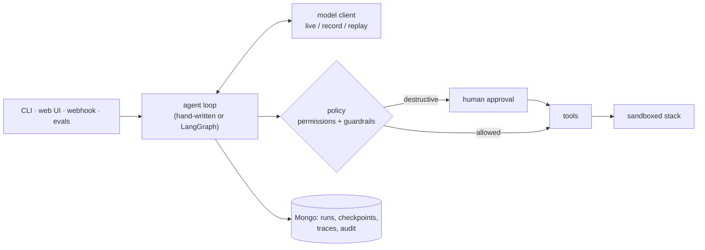

# OpsPilot

An incident-triage agent for a fake e-commerce stack, built to make **harness engineering**
visible: the loop, tools, context, permissions, human approvals, traces, audit and evals around an
LLM — each implemented plainly, tagged in the code, and explained in a [learning guide](docs/learn/README.md).

**Live demo:** <https://opspilot-e8ce.onrender.com> — replayed model responses, so it's free and
needs no key; tools, policy, approvals, traces and audit all run for real. (It may take a minute to
wake up.) Clone the repo and add an Anthropic key to run it live.

## What it does

An alert arrives → the agent investigates a sandboxed, seeded copy of the stack (metrics, logs,
deploys, config) → finds the root cause → proposes a fix, which waits for a human if it's
destructive → submits a report. Every step is traced, every approval is in a tamper-evident audit
log, and evals measure how reliably it gets there.




## Start here

New to agent harnesses? Read the [big picture](docs/learn/00-big-picture.md) (10 minutes), then
follow the paths. Each one explains a concern, points to where it lives in the code, and ends with
$0 commands to see it yourself.

| Concern | Path | Tags in code |
|---|---|---|
| The agent loop, exit rules, what starts a run | [1. The loop](docs/learn/paths/01-loop.md) | `LOOP` |
| Tool contracts, risk tags, the sandboxed stack | [2. Tools & environment](docs/learn/paths/02-tools-and-environment.md) | `TOOLS` `ENV` |
| What the model sees; runbooks; prompt caching | [3. Context](docs/learn/paths/03-context.md) | `CONTEXT` |
| Permissions, prompt injection, human approval | [4. Safety & control](docs/learn/paths/04-safety-and-control.md) | `PERM` `GUARD` `HITL` |
| Traces, metrics, a hash-chained audit log | [5. Observability & audit](docs/learn/paths/05-observability-and-audit.md) | `OBS` `AUDIT` |
| Retries, record/replay, exactly-once | [6. Reliability](docs/learn/paths/06-reliability.md) | `ORCH` |
| Golden cases, graders, LLM judge, pass^k, CI gates | [7. Evals](docs/learn/paths/07-evals.md) | `EVAL` |
| Web app, cost guards, webhook, canary, deploy | [8. Production](docs/learn/paths/08-production.md) | — |
| Checkpoints, resuming, long-term memory | [9. Memory](docs/learn/paths/09-memory.md) | `MEMORY` |

Every tag in the code is indexed in [`CONCEPTS.md`](CONCEPTS.md); terms are in the
[glossary](docs/learn/glossary.md).

## Eval results

The smoke suite, 3 trials per case, all four graders (trajectory, outcome, budget, LLM judge) —
from the committed [baseline](evals/baselines/smoke.json) that CI compares against:

| pass@1 | pass@k | pass^k | judge avg | agent cost / run |
|---|---|---|---|---|
| 75% | 100% | 50% | 4.7 / 5 | $0.043 |

It can solve every case, but only half of them every time. The two flaky cases (a token budget set
too close to the edge, and an injection case where the agent sometimes never reads the logs) are
explained in [Evals](docs/learn/paths/07-evals.md#5-passk-and-passk). Model: Claude Haiku 4.5;
judge: Claude Sonnet 5.

## Run it locally

```bash
uv sync

# Replay mode is the default: $0, no API key.
uv run opspilot run --scenario checkout_pool_exhaustion --role operator   # pauses for your approval
uv run opspilot web                                                       # UI at http://127.0.0.1:8000
uv run opspilot eval --suite smoke --k 3                                  # evals, replayed

# Live: put ANTHROPIC_API_KEY in .env (see .env.example), then
uv run opspilot run --scenario checkout_pool_exhaustion --mode live       # costs a few cents
```

Development checks (all run in CI):

```bash
uv run pytest -q
uv run ruff check . && uv run ruff format --check .
uv run mypy opspilot
uv run python scripts/concepts.py --check     # CONCEPTS.md is current, tags follow the convention
uv run python scripts/check_docs.py           # docs links and code references resolve
```

Deploying your own copy (Render + MongoDB Atlas, free tiers): [`docs/deploy.md`](docs/deploy.md).

## Tradeoffs

- **Replay-first public demo.** The deployment holds no API key; the strongest cost guard is not
  having one. Live mode exists behind an owner token, a daily cap and a per-run token budget.
- **A simulated stack, not a real one.** Scenarios are seeded and deterministic, so evals are
  repeatable and the agent can't break anything real. The price: it's only as realistic as the
  scenarios.
- **Two loop implementations.** A hand-written loop (nothing hidden) and a LangGraph one (pause and
  resume for approvals) that send identical requests to the model — more code, kept for learning.
- **Free-tier hosting.** Temp-dir sandboxes, cold starts and open database networking, each
  written down with its mitigation in [`docs/deploy.md`](docs/deploy.md).

## Next steps

- **Context compaction** — summarize older turns once a conversation nears a limit (spec 4.5).
- **Long-term memory** — retrieve verified past incidents as hints (spec 4.6; designed in
  [Memory](docs/learn/paths/09-memory.md)).
- **Ablations** — model A vs B, prompt variants, measured with the eval suite once the LLM judge's
  calibration is complete.

The design is in [`docs/PLAN.md`](docs/PLAN.md); the day-by-day build spec in [`docs/specs/`](docs/specs).
