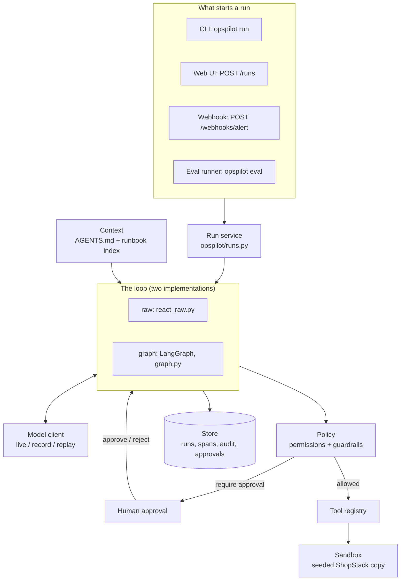

# 0. The big picture

> Part of the [learning guide](README.md). Read this first: it's the map the paths fill in.

## An agent is a model plus a harness

A language model on its own turns text into text. It can't run a command, remember the
last call, notice it's going in circles, or ask for permission. Everything that makes it
an *agent* lives around it, and that surrounding code is the **harness**:

- **what it sees** — the system prompt, the alert, tool results, how much of each (*context*)
- **what it can do** — the tools, and the world they act on (*tools & environment*)
- **what it may do** — roles, approvals, guardrails (*safety & control*)
- **how it keeps going, and when it stops** — the loop and its exit conditions (*loop*)
- **what gets recorded** — traces, metrics, an audit log (*observability & audit*)
- **how it survives the real world** — retries, restarts, duplicate requests (*reliability*)
- **how we know it works** — datasets, graders, gates (*evals*)

The model decides *what to do next*. The harness decides everything else. In this project
the model is replaceable (live, scripted, or replayed from a recording); the harness is
what's being built and studied.

## OpsPilot in one paragraph

OpsPilot is an incident-triage agent for **ShopStack**, a fake e-commerce system (services
`web`, `checkout`, `payments`, `inventory`, `db`). An alert arrives, e.g. *"checkout: p95 latency
> 2000ms"*. The agent investigates a freshly generated, seeded copy of ShopStack — logs,
metrics, configs, deploys — with **read** tools, can fix things with **destructive** tools
(`restart_service`, `rollback_config`, `rollback_deploy`), and finishes with a **terminal** tool:
`submit_report` or `escalate`. Six scenarios (`opspilot/env/scenarios.py::SCENARIOS`) each hide a
known root cause, including a false alarm and a prompt-injection attack planted in a log file.

What's real and what's simulated:

| Part | Status |
|---|---|
| ShopStack (logs, metrics, configs) | **simulated** — generated per run from a scenario + seed |
| The model | **real or recorded** — live Claude calls, or replayed recordings of real ones ($0) |
| Everything else (loop, tools, policy, approvals, traces, audit, evals) | **real** |

## The pieces



The **run service** builds a run (sandbox, record in the store) and hands it to one of two
loop implementations. The **raw** loop is written by hand to show every moving part; the
**graph** loop does the same with LangGraph, which adds checkpointing — and with it, real
pauses for human approval. Both talk to the model only through one interface, so the model
can be live, scripted for tests, or replayed from a recording.

## One run, end to end

An operator-role run of the pool-exhaustion scenario, started from the web UI:

```mermaid
sequenceDiagram
    autonumber
    actor Human
    participant App as Web app + run service
    participant Loop as Graph loop
    participant Model
    participant Policy
    participant Tools as Tools + sandbox
    participant Store

    Human->>App: start run (scenario, role)
    App->>Store: RunDoc, fresh sandbox from (scenario, seed)
    App->>Loop: system prompt + alert
    loop until a terminal tool, or an exit condition
        Loop->>Model: everything so far (+ tool schemas)
        Model-->>Loop: tool_use: query_metrics(checkout, latency)
        Loop->>Policy: role x tool risk, scope check
        Policy-->>Loop: allow
        Loop->>Tools: run it (framed as untrusted data, truncated)
        Tools-->>Loop: result
        Loop->>Store: spans (model call, policy check, tool call)
    end
    Model-->>Loop: tool_use: rollback_config(checkout, 12)
    Loop->>Policy: destructive + operator
    Policy-->>Loop: require approval
    Loop->>Store: pending approval, checkpoint (run paused)
    Human->>App: approve
    App->>Loop: resume from the checkpoint
    Loop->>Tools: rollback_config runs
    Loop->>Store: audit entry (decision, then execution)
    Model-->>Loop: tool_use: submit_report(root cause, evidence)
    Loop->>Store: outcome, tokens, cost, report
```

The same steps, with where they live:

1. **Start.** The web app (or CLI, webhook, eval runner) asks the run service to create a
   run: `opspilot/runs.py::create_run` builds a sandbox from the scenario and seed and stores
   a `RunDoc`. → [Production](paths/08-production.md), [Tools & environment](paths/02-tools-and-environment.md)
2. **Context.** The system prompt is [`AGENTS.md`](../../opspilot/context/AGENTS.md) plus a one-line index of runbooks, cached
   as a prefix: `opspilot/context/assembler.py::build_system_blocks`. → [Context](paths/03-context.md)
3. **Think.** The loop sends the whole conversation so far to the model:
   `opspilot/loops/graph.py::run_react_graph` (or the hand-written
   `opspilot/loops/react_raw.py::run_react_loop`). → [The loop](paths/01-loop.md)
4. **Check.** Each tool call the model asks for goes through the permission policy:
   `opspilot/policy/permissions.py::decide`. → [Safety & control](paths/04-safety-and-control.md)
5. **Act.** Allowed calls run through the tool registry against the sandbox:
   `opspilot/tools/base.py::ToolRegistry`. Results come back framed as untrusted data
   and size-capped. → [Tools & environment](paths/02-tools-and-environment.md)
6. **Pause.** A destructive call by an operator needs a human. The graph pauses at a
   checkpoint; the decision is claimed exactly once and the run resumes, possibly in
   another process: `opspilot/loops/graph.py::resume_react_graph`. → [Safety & control](paths/04-safety-and-control.md), [Memory](paths/09-memory.md)
7. **Record.** Every model call, policy check, tool call and wait becomes a span; every
   denial, decision and destructive action an audit entry in a hash chain:
   `opspilot/observability/tracer.py::Tracer`, `opspilot/observability/audit.py::record_audit`.
   → [Observability & audit](paths/05-observability-and-audit.md)
8. **Finish.** `submit_report` or `escalate` ends the run; so do the step cap, the token
   budget, stuck detection, or two turns with no tool call. → [The loop](paths/01-loop.md)
9. **Judge.** Offline, the eval runner runs the same thing many times and grades the
   trajectory, the diagnosis, the cost and the report quality. → [Evals](paths/07-evals.md)

## The concerns, and where to learn each

| Concern | Tag in code | Path |
|---|---|---|
| The agent loop and what starts it | `LOOP` | [1. The loop](paths/01-loop.md) |
| Tools and the sandboxed world | `TOOLS`, `ENV` | [2. Tools & environment](paths/02-tools-and-environment.md) |
| What the model is told | `CONTEXT` | [3. Context](paths/03-context.md) |
| Permissions, guardrails, approvals | `PERM`, `GUARD`, `HITL` | [4. Safety & control](paths/04-safety-and-control.md) |
| Traces, metrics, audit log | `OBS`, `AUDIT` | [5. Observability & audit](paths/05-observability-and-audit.md) |
| Retries, backends, idempotency | `ORCH` | [6. Reliability](paths/06-reliability.md) |
| Measuring the agent | `EVAL` | [7. Evals](paths/07-evals.md) |
| Running it for others | (several) | [8. Production](paths/08-production.md) |
| What persists | `MEMORY` | [9. Memory](paths/09-memory.md) |

Every implementation site carries a `[HARNESS:<TAG>]` comment; [`CONCEPTS.md`](../../CONCEPTS.md)
lists all of them.

## See it yourself ($0, no API key)

```bash
uv run opspilot run --scenario checkout_pool_exhaustion --role operator   # replays a recorded run; answer y
uv run opspilot web                                                       # same thing in the browser
```

Or try the [public demo](https://opspilot-e8ce.onrender.com) — it replays recordings too.

## Further reading

- [Building effective agents](https://www.anthropic.com/engineering/building-effective-agents) — Anthropic. Workflows vs agents, and why simple, composable patterns win.
- [Effective harnesses for long-running agents](https://www.anthropic.com/engineering/effective-harnesses-for-long-running-agents) — Anthropic. The harness as the thing you engineer.
- [ReAct: Synergizing Reasoning and Acting in Language Models](https://arxiv.org/abs/2210.03629) — Yao et al., 2022. The think → act → observe pattern this loop follows.
- [12-Factor Agents](https://github.com/humanlayer/12-factor-agents) — HumanLayer. Principles for agents that run in production.
