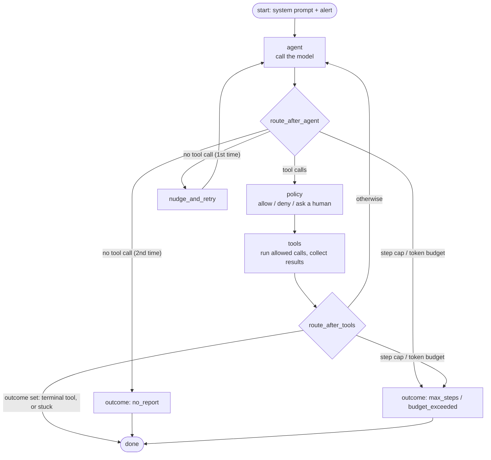

# 1. The loop

> Part of the [learning guide](../README.md). Before this: [the big picture](../00-big-picture.md).

## In one sentence

The loop sends the conversation to the model, runs the tools it asks for, appends the results,
and repeats — until the model finishes on purpose or a rule stops it.

## Why it matters

A model never "runs" on its own: each API call is one turn, and the harness decides whether
there's another. Get the loop wrong and the agent:

- **never stops** — a confused model can call tools forever, burning tokens;
- **stops too early, silently** — it replies with prose instead of acting, and nobody notices;
- **spins** — the same tool, the same arguments, the same result, again and again;
- **confuses the API** — several tool calls in one turn need their results paired correctly.

## Key terms

[ReAct](../glossary.md#r) · [exit condition](../glossary.md#e) · [terminal tool](../glossary.md#t) ·
[stuck detection](../glossary.md#s) · [budget](../glossary.md#b) · [outer loop](../glossary.md#o) ·
[LangGraph](../glossary.md#l) · [checkpointer](../glossary.md#c)

## The shape of it

The graph version of the loop, node by node (`opspilot/loops/graph.py::build_graph`):



## Walkthrough

### 1. One turn, by hand

Start with the hand-written loop: `opspilot/loops/react_raw.py::run_react_loop`. It is the whole
agent, top to bottom, with no framework:

1. **Think.** Send the system prompt, the tool schemas and *every message so far* to the model.
   The model keeps no memory between calls; the `messages` list is the memory (see
   [Memory](09-memory.md)).
2. **Act.** If the reply contains `tool_use` blocks, run each one (after the permission check in
   [Safety & control](04-safety-and-control.md)).
3. **Observe.** Append the results as `tool_result` blocks — **all of them in one user message**,
   each paired to its `tool_use_id`. The API expects that pairing; splitting results across
   messages breaks it and discourages the model from calling tools in parallel.
4. Repeat.

### 2. Five ways to stop

Every run ends with one of these outcomes, and each is a deliberate rule (tagged
`[HARNESS:LOOP] Exit condition #n` in the code):

| # | Rule | Outcome | Why it exists |
|---|---|---|---|
| 1 | The model called `submit_report` or `escalate` | `completed` / `escalated` | The happy path: finishing is an explicit, structured act. |
| 2 | Step cap reached (`OPSPILOT_MAX_STEPS`) | `max_steps` | The cheapest backstop; checked before each model call. |
| 3 | Cumulative token budget exceeded | `budget_exceeded` | Steps don't bound cost — one step can carry a huge tool result. |
| 4 | Same tool + same args four times in a row | `stuck` | Three repeats get one nudge; the fourth ends it. |
| 5 | No tool call, twice | `no_report` | The first time, a nudge back to the contract; models often self-correct. |

Why a **terminal tool** instead of "stop when the model stops talking"? Because a report is
structured data (root cause, evidence, confidence) that downstream code — evals, the UI — needs.
A tool with an input schema gets that structure validated; free text doesn't. The tools
themselves are in `opspilot/tools/terminal.py` (see [Tools & environment](02-tools-and-environment.md)).

### 3. The same loop as a graph

`opspilot/loops/graph.py::run_react_graph` implements the identical behavior with LangGraph: the
steps become **nodes** (`agent`, `policy`, `tools`, `nudge_and_retry`, and one node per limit
outcome) and the exit rules become **routing functions** between them
(`opspilot/loops/graph.py::route_after_agent`, `opspilot/loops/graph.py::route_after_tools`).

Why have both? The raw loop shows every moving part. The graph adds something the raw loop
can't do cleanly: a **checkpointer** saves the state after every node, so a run can *pause*
(for a human approval) and *resume* later — even in another process. The raw loop treats
"needs approval" as a denial; the graph really waits. See [Safety & control](04-safety-and-control.md).

Both send byte-identical requests to the model for the same conversation; a test guards that:
`tests/loops/test_strategy_parity.py`. That's what lets one recording replay under either loop.

### 4. Outer loops: what starts a run

The loop above is the **inner, goal-driven loop**: it runs until the task is done. Something has
to start it, and that's a different set of loops:

| Outer loop | What triggers it | Where |
|---|---|---|
| Interactive | A person, from the CLI or the web UI | `opspilot/cli.py`, `opspilot/web/app.py::create_app` |
| Event | An alert posted to a signed webhook | `opspilot/web/webhooks.py::verify` |
| Time-based | A weekly schedule in CI | `.github/workflows/canary.yml` |
| Heartbeat | That schedule sending a known-answer alert to production | `scripts/canary.py::run_canary` |

The webhook and canary are covered in [Production](08-production.md).

**One outer loop that isn't built: a "Ralph" loop.** That's the brute-force outer loop: run the
agent again and again until an external check passes. Here it would wrap a *change*, not a run:
propose a prompt or tool edit, run the live golden evals, keep the edit if pass^k and cost beat the
baseline, otherwise retry with the failures as feedback. The pieces exist (evals, gates, compare —
see [Evals](07-evals.md)). It stays a sketch because every iteration is a paid live eval, and
looping against a fixed golden set tends to overfit it.

## Design decisions

- **Exit rules are code, not prompt.** The prompt asks the model to finish with a report; the
  step cap, budget and stuck detection don't rely on it agreeing. *Alternative:* trust the model
  to stop — fine until the one run that doesn't.
- **Nudge once, then stop.** One explicit reminder fixes most drift; nudging forever just spends
  money. Each rule has its own outcome, so evals can tell *how* a run ended.
- **Hand-written first, framework second.** The raw loop came first so nothing is hidden; the
  graph was added when checkpointing (pausing for humans) justified a framework.

## See it yourself ($0)

```bash
# The raw loop, turn by turn (replayed). Step 1 shows three tool calls in one turn.
uv run opspilot run --scenario false_alarm --strategy raw

# Same run with a 2-step cap: watch exit rule #2 fire.
uv run opspilot run --scenario false_alarm --strategy raw --max-steps 2

# Every exit condition has a test.
uv run pytest -q tests/loops
```

## Check your understanding

<details><summary>Why is the step cap checked <em>before</em> each model call rather than after?</summary>

Because the model call is the expensive part. Checking first means the run never pays for a call
it was going to throw away.
</details>

<details><summary>The model returns two <code>tool_use</code> blocks in one reply. What does the next request contain?</summary>

One user message with two `tool_result` blocks, each carrying the `tool_use_id` it answers —
not two separate messages.
</details>

<details><summary>Why does a step cap alone not protect your API bill?</summary>

Steps and tokens are different resources: one step can include a huge tool result, and the whole
conversation is resent every turn. The token budget bounds cost directly.
</details>

<details><summary>What does the graph version add that the raw loop can't easily do?</summary>

Pausing and resuming. The checkpointer persists state after every node, so a run can stop at a
human approval and continue later, even in a different process.
</details>

## Further reading

- [ReAct: Synergizing Reasoning and Acting in Language Models](https://arxiv.org/abs/2210.03629) — the reason → act → observe pattern.
- [Building effective agents](https://www.anthropic.com/engineering/building-effective-agents) — Anthropic. When an agent loop is the right tool, and when a fixed workflow is.
- [Tool use with Claude](https://platform.claude.com/docs/en/agents-and-tools/tool-use/overview) — how `tool_use` and `tool_result` blocks pair up in the API.
- [LangGraph: Graph API overview](https://docs.langchain.com/oss/python/langgraph/graph-api) — nodes, edges and conditional routing.

Next: [2. Tools & environment](02-tools-and-environment.md)
