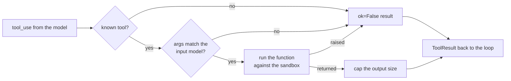

# 2. Tools & environment

> Part of the [learning guide](../README.md). Before this: [1. The loop](01-loop.md).

## In one sentence

Tools are the agent's hands — typed functions with a declared risk — and the environment is the
seeded, sandboxed copy of ShopStack those hands act on.

## Why it matters

The model only *describes* actions; tools carry them out. Every argument is model-generated text,
so tools are an attack surface and a source of errors:

- **bad arguments** — a missing field, a wrong type, a made-up service name;
- **failures** — a tool bug or a bad regex shouldn't kill the whole run;
- **huge outputs** — one unfiltered log dump can use up the token budget in a single step;
- **escape attempts** — `../../etc/passwd` passed as a "service name";
- **untestable worlds** — an environment that differs between runs can't be evaluated.

## Key terms

[tool](../glossary.md#t) · [tool result](../glossary.md#t) · [risk class](../glossary.md#r) ·
[destructive tool](../glossary.md#d) · [terminal tool](../glossary.md#t) ·
[sandbox](../glossary.md#s) · [scenario](../glossary.md#s)

## The shape of it

What happens to one tool call (`opspilot/tools/base.py::ToolRegistry`):



Every path ends in a `ToolResult`. Nothing a tool does — or a model sends — can crash the loop.

## Walkthrough

### 1. The tool contract

A tool is five things (`opspilot/tools/base.py::Tool`): a **name**, a **description** the model
reads, an **input model** (pydantic), a **risk** class, and the **function** that does the work.

The input model does double duty: `opspilot/tools/base.py::ToolRegistry` turns it into the JSON
schema the model sees (`to_anthropic_schema`) *and* uses it to validate the arguments that come
back. One source of truth, so what a tool accepts can never drift from what it advertises.

### 2. Risk classes: read, destructive, terminal

Every tool declares one (`opspilot/tools/base.py::Risk`), and the permission policy keys off the
class, not the tool name — a new tool is governed the moment it's registered.

| Risk | Tools | What they do |
|---|---|---|
| `read` | `list_services`, `grep_logs`, `query_metrics`, `read_config`, `config_history`, `list_deploys`, `load_runbook` | Look; never change anything. |
| `destructive` | `restart_service`, `rollback_config`, `rollback_deploy` | Change the environment. Gated by role and approval. |
| `terminal` | `submit_report`, `escalate` | End the run with structured output. |

The implementations live in `opspilot/tools/read.py`, `opspilot/tools/destructive.py` and
`opspilot/tools/terminal.py`.

### 3. Errors are results, not exceptions

`opspilot/tools/base.py::ToolRegistry` runs every call through three guards, in order:

1. **Unknown tool** → `ok=False`, "unknown tool".
2. **Arguments that don't validate** → `ok=False` with pydantic's message. The model reads it on
   the next turn and retries with corrected arguments — *schema-driven self-correction*.
3. **The function raises** → `ok=False` with the exception text. One buggy tool can't end the run.

The terminal tools use the same mechanism as an output guardrail:
`opspilot/tools/terminal.py::SubmitReportInput` requires a root-cause label in a fixed
`category:service[:detail]` shape and at least one piece of evidence. A malformed report is just
another `ok=False` result the model can fix.

### 4. Capping output size

After a tool runs, its text is cut to `OPSPILOT_TOOL_OUTPUT_MAX_CHARS` (4,000 by default) with an
explicit hint: `...[N more lines truncated, narrow your pattern]`. A silent cut would let the
model believe it saw everything; the hint tells it to ask a narrower question. (Why output size
matters so much is the subject of [Context](03-context.md).)

### 5. The sandbox: a private world per run

Each run gets its own directory: `opspilot/env/sandbox.py::Sandbox`. Inside, a full fake ShopStack:

```text
config/<service>.yaml         current configs, plus config/history/<service>/v<n>.yaml
logs/<service>.log            an hour of log lines per service
metrics.db                    an hour of metrics (latency, error rate, memory, disk, ...)
deploys.json                  deploy history
state.json                    service status (what restart_service changes)
```

Tools reach these files only through `Sandbox.path`, which rejects absolute paths and `..`, then
resolves the result and checks it's still inside the root — so a symlink can't escape either.

### 6. Reproducible, with hidden ground truth

`opspilot/env/generator.py::build_sandbox` generates all of it from a **scenario and a seed**:
one seeded random generator and a fixed start time, never the global `random` or the wall clock.
Same scenario + seed → byte-identical files, on any machine. That's what makes evals repeatable
and recordings replayable.

A scenario (`opspilot/env/scenarios.py::Scenario`) carries the alert the agent sees *and* hidden
ground truth — the root cause and the expected fix. The generator and the evals read it; nothing
the agent can reach does. A correct diagnosis has to come from investigating.

Two more details, used later in the guide:

- `opspilot/env/sandbox.py::Sandbox` also exposes `facts()`: the end state as readable keys
  (`checkout.config_version: 12`) so graders can check side effects. → [Evals](07-evals.md)
- On a host whose disk is wiped on restart, a lost sandbox can be regenerated from scenario +
  seed — but only if nothing destructive has run yet. → [Production](08-production.md)

## Design decisions

- **One pydantic model per tool** for schema *and* validation. *Alternative:* hand-written JSON
  schemas — they drift from the code that parses arguments.
- **Errors become tool results.** *Alternative:* raise and abort — but most errors are things
  the model can fix if it's told what went wrong.
- **Risk lives on the tool.** *Alternative:* a list of dangerous tool names in the policy — easy
  to forget to update.
- **A generated file tree, not real infrastructure.** Cheap, safe, and identical every time —
  what you need to evaluate an agent. Real systems would need real isolation (containers, VMs).

## See it yourself ($0)

```bash
# Generate a sandbox and look inside.
uv run opspilot env build --scenario checkout_pool_exhaustion --seed 42 --out tmp/sbx
ls -R tmp/sbx && head tmp/sbx/logs/checkout.log

# Watch the path guard refuse an escape.
uv run python -c "from pathlib import Path; from opspilot.env.sandbox import Sandbox; Sandbox(root=Path('tmp/sbx')).path('../../etc/passwd')"

# Tests: each tool, validation errors, truncation, sandbox containment.
uv run pytest -q tests/tools tests/env
```

## Check your understanding

<details><summary>The model calls <code>grep_logs</code> without the required <code>service</code> argument. What happens?</summary>

Pydantic validation fails, and the registry returns `ok=False` with the validation message as the
tool result. The run continues; the model sees the error and can call again correctly.
</details>

<details><summary>Why does truncation add a hint instead of cutting silently?</summary>

A silent cut makes the model think it has the whole picture. The hint tells it the result is
partial and suggests narrowing the query.
</details>

<details><summary>Where does the permission policy get a tool's risk from — and why there?</summary>

From the tool itself (`risk` on the `Tool`). A newly registered tool is governed immediately, with
no separate list of dangerous names to keep in sync.
</details>

<details><summary>Why is the generator seeded and given a fixed start time?</summary>

So the same scenario and seed always produce the same files. Evals compare runs, and recorded
model responses only replay if the tool outputs are identical.
</details>

## Further reading

- [Writing effective tools for AI agents](https://www.anthropic.com/engineering/writing-tools-for-agents) — Anthropic. Names, descriptions and error messages as part of the tool's interface.
- [Define tools](https://platform.claude.com/docs/en/agents-and-tools/tool-use/define-tools) — Claude docs. Tool names, descriptions and input schemas.
- [JSON Schema](https://pydantic.dev/docs/validation/latest/concepts/json_schema/) — Pydantic docs. How a model class becomes a schema.
- [Path Traversal](https://community.owasp.org/attacks/Path_Traversal) — OWASP. The attack the sandbox guard blocks.

Next: [3. Context](03-context.md)
