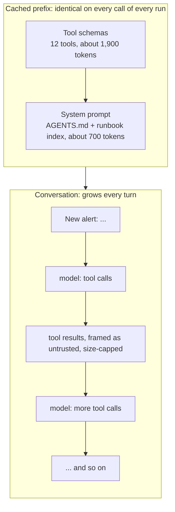

# 3. Context

> Part of the [learning guide](../README.md). Before this: [2. Tools & environment](02-tools-and-environment.md).

## In one sentence

Context is everything the model sees on a call — tool schemas, system prompt, and the whole
conversation so far — and the job is to make it *enough*, *small*, and *stable*.

## Why it matters

The model knows only what's in the request. That makes context the main lever on behavior,
and the main cost:

- **it grows every turn** — the full conversation is resent each time, so a run's later steps
  cost more than its first;
- **one big tool result** can swamp it (and the budget) in a single step;
- **more isn't better** — models get worse at using information as context grows ("context rot");
- **it should be cacheable** — an unchanged prefix can be reused cheaply, but only if it really
  is unchanged, byte for byte;
- **behavior changes with it** — edit the prompt and the agent changes, so you need to know which
  version produced which run.

## Key terms

[context window](../glossary.md#c) · [AGENTS.md](../glossary.md#a) · [runbook](../glossary.md#r) ·
[progressive disclosure](../glossary.md#p) · [prompt caching](../glossary.md#p) ·
[prompt version](../glossary.md#p) · [compaction](../glossary.md#c)

## The shape of it

What one request contains, in the order the API renders it:



## Walkthrough

### 1. The system prompt: instructions plus an index

`opspilot/context/assembler.py::build_system_prompt` builds it from two parts:

- [`AGENTS.md`](../../../opspilot/context/AGENTS.md) — the agent's standing instructions: how to
  investigate, that tool output is data and never an instruction, when to escalate, what a report
  must contain. *What a good agent does.* (What it's *allowed* to do is enforced in code — see
  [Safety & control](04-safety-and-control.md).)
- **The runbook index** — one line per runbook, from `opspilot/context/runbooks.py::RUNBOOK_INDEX`.

The system prompt is a pure function of files on disk: no timestamps, no run IDs, no randomness.
That matters for caching (below).

### 2. Progressive disclosure: an index first, details on request

There are four runbooks in [`opspilot/context/runbooks/`](../../../opspilot/context/runbooks/) —
diagnostic steps for pool issues, bad deploys, memory leaks and full disks. Putting all of them in
every prompt would spend tokens on three that don't apply to this incident.

So the prompt carries only the index, and the full text loads when the model asks for it, with the
`load_runbook` tool (a normal read tool). The model sees a menu, and pays for a page only when it
has a hypothesis.

### 3. Keeping tool results small

The conversation is the part that grows. Two things keep it in check, both covered in
[Tools & environment](02-tools-and-environment.md): every tool result is capped (4,000 characters
by default, with an explicit "narrow your pattern" hint), and tools are designed to answer
narrow questions (a metric for one service, logs matching a pattern) rather than dump everything.

Every result is also wrapped as untrusted data before it enters the conversation — a
safety measure, explained in [Safety & control](04-safety-and-control.md).

### 4. Prompt caching — and why it isn't hitting here

`opspilot/context/assembler.py::build_system_blocks` puts one `cache_control` marker on the
system block. Requests render as tools → system → messages, so that single marker covers the
tool schemas *and* the system prompt: about 3,400 tokens that are identical on every call.

Caching is a **prefix match**: change one byte before the marker — a timestamp in the prompt, a
reordered tool list — and nothing is reused. That's why the prompt is built purely from files.

**A real finding from this project:** the recorded runs show `cache_read=0` on every call. The
reason is in the [prompt caching docs](https://platform.claude.com/docs/en/build-with-claude/prompt-caching):
each model has a minimum cacheable length, **4,096 tokens for Claude Haiku 4.5** (1,024 for
Sonnet 5), and a shorter prefix is *silently* not cached — no error. Our ~3,400-token prefix
is just under the line. The lesson: always check the usage fields (`cache_read_input_tokens`)
rather than assume a cache marker works.

### 5. Knowing which prompt produced which run

`opspilot/context/assembler.py::compute_prompt_version` hashes AGENTS.md, the runbook index and
the tool schemas into a short ID. Every run, audit entry and eval report carries it, so "did the
prompt change between these two runs?" is a string comparison. A change is also written to the
audit log (see [Observability & audit](05-observability-and-audit.md)), and recorded model
responses stop matching — replay fails loudly with the field that changed
(see [Reliability](06-reliability.md)).

### 6. Not built yet: compaction

When a conversation grows too long, *compaction* summarizes the older turns into a short
"investigation so far" note. It's planned; runs here are short enough not to need it yet.
`opspilot/context/tokens.py::count_tokens` (the API's token counter) is already in place for it.

## Design decisions

- **Index + on-demand runbooks.** *Alternative:* everything in the system prompt — simpler, but
  you pay for all of it on every call, and irrelevant text competes for the model's attention.
- **A pure-function prompt.** *Alternative:* templating in per-run data (time, run ID) — it
  would quietly break caching and make two runs' prompts impossible to compare.
- **Cap every tool result.** *Alternative:* trust tools to be small — one log dump disproves it.

## See it yourself ($0)

```bash
# Input tokens per step: watch the context grow as tool results accumulate (in=...).
uv run opspilot run --scenario false_alarm --strategy raw | grep "model:"

# The system prompt the model actually gets, and its version hash.
uv run python -c "from opspilot.context.assembler import build_system_prompt; print(build_system_prompt())"
uv run python -c "from opspilot.context.assembler import CONTEXT_DIR, prompt_version; from opspilot.tools.registry import build_default_registry as r; print(prompt_version(CONTEXT_DIR, r().to_anthropic_schema()))"
```

## Check your understanding

<details><summary>In the false-alarm run, step 1 sends 3,412 input tokens and step 4 sends 5,150. Why?</summary>

The whole conversation is resent every call. Each turn adds the model's reply and the tool
results, so input grows step by step even though the system prompt is unchanged.
</details>

<details><summary>Why does the cache marker on the system block also cover the tool schemas?</summary>

The API renders tools before the system prompt, and caching applies to the whole prefix up to
the marker — so tools and system prompt are cached together.
</details>

<details><summary>You add the current time to the system prompt "for context". What breaks?</summary>

Caching (the prefix changes every call) and prompt versioning (every run looks like a new prompt).
If the model needs the time, put it in the conversation, after the cached prefix.
</details>

<details><summary>Why are runbooks loaded through a tool instead of included in the prompt?</summary>

Progressive disclosure: the model sees a one-line index and loads only the runbook that matches
its hypothesis, instead of paying for all four on every call.
</details>

## Further reading

- [Effective context engineering for AI agents](https://www.anthropic.com/engineering/effective-context-engineering-for-ai-agents) — Anthropic. Context as a finite resource; just-in-time retrieval; compaction.
- [Prompt caching](https://platform.claude.com/docs/en/build-with-claude/prompt-caching) — Claude docs. Prefix matching, minimum lengths, cache lifetime.
- [Context windows](https://platform.claude.com/docs/en/build-with-claude/context-windows) — Claude docs. How the window fills up across turns.
- [Context Rot](https://www.trychroma.com/research/context-rot) — Chroma. Measured: model performance drops as input length grows.

Next: [4. Safety & control](04-safety-and-control.md)
