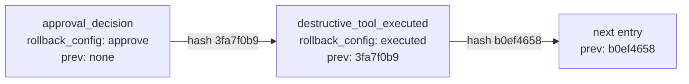

# 5. Observability & audit

> Part of the [learning guide](../README.md). Before this: [4. Safety & control](04-safety-and-control.md).

## In one sentence

Observability records what a run did — every model call, decision and tool call, timed and
nested — and the audit log records who allowed what, in a form that shows if it was changed.

## Why it matters

An agent's behavior is the sum of many small choices, and "it returned the wrong answer" says
nothing about why. Without a record:

- **you can't debug** — was it the prompt, a tool result, a policy denial, a slow model call?
- **you can't see cost** — which runs, scenarios or steps are expensive, and why?
- **you can't trend** — is the tool error rate rising? are runs getting slower?
- **you can't prove anything** — after an incident, "who approved that restart?" needs an answer
  nobody could have quietly edited.

Two different tools for two different questions: **traces and metrics** answer *what happened
and how well*; the **audit log** answers *who was allowed to do what* — and has to be trustworthy
even against someone with database access.

## Key terms

[span](../glossary.md#s) · [trace](../glossary.md#t) · [audit log](../glossary.md#a) ·
[prompt version](../glossary.md#p)

## The shape of it

One operator run as spans — this is the real output of `scripts/inspect_run.py` (shortened):

```text
run            react_graph            22ms
  model_call     model.create          1ms   [in=3429 out=299]
  policy_check   policy                0ms   [allowed]
  tool_call      list_services         0ms   [ok=True 79 chars]
  tool_call      query_metrics         0ms   [ok=True 675 chars]
  ...
  model_call     model.create          1ms   [in=6739 out=98]
approval_wait  rollback_config        36ms
policy_check   policy                 0ms   [allowed]
tool_call      rollback_config        1ms   [ok=True 34 chars]
...
tool_call      submit_report          0ms   [ok=True 16 chars]
```

(Replayed model calls take about 1ms; live ones take seconds. Note that everything after
`approval_wait` sits at the top level — see the gap in section 2.)

And its audit log, a hash chain:



## Walkthrough

### 1. Spans: one timed unit of work each

`opspilot/observability/tracer.py::Tracer` writes a span for each unit of work, with a kind,
a name, start and duration, a status, and attributes. The kinds:

| Kind | What it times | Useful attributes |
|---|---|---|
| `run` | the whole run | scenario, seed, role, strategy |
| `model_call` | one model call | input/output tokens, cache tokens, stop reason |
| `policy_check` | the permission decision for a turn's calls | per-call decision or denial reason |
| `tool_call` | one tool execution | tool, args (redacted if large), ok, output size |
| `approval_wait` | how long a human took to decide | approval ID, decision |
| `guardrail` | an injection pattern matched | the patterns |

Spans nest automatically: the tracer keeps the *current span* in a context variable, so any
code that runs inside an open span — even in another coroutine — becomes its child, with no
parent IDs passed around. Large tool arguments become `<redacted: N chars>`
(`opspilot/observability/tracer.py::redact_if_large`), which is why the run's report is stored
on the run record instead of read back from the trace.

### 2. Two loops, two ways to trace

- **The graph loop writes spans live**, as each node runs: `opspilot/loops/graph.py::build_graph`.
- **The raw loop doesn't know tracing exists.** It emits simple events for the CLI printer; after
  the run, `opspilot/observability/instrumentation.py::record_loop_spans` replays those events
  into spans, advancing a clock by each step's own duration. Because the loop runs strictly in
  sequence, the rebuilt timeline is exact. Tracing became a second consumer of the events, with
  no change to the loop.

A gap you can see in the output above: when a run **resumes after an approval**, the resumed
part isn't inside the original `run` span — that span closed when the run paused, possibly in
another process. The resumed spans are recorded, just not nested.

### 3. Metrics: aggregate many runs

`opspilot/observability/metrics.py::build_dashboard` computes four views across all runs:
model-call latency p50/p95, error rate per tool, outcome counts, and average cost per scenario.
With Mongo these run *inside the database* as aggregation pipelines
(`opspilot/store/mongo.py::MongoStore`, using `$group` and `$percentile`); pulling every span
into Python and computing there doesn't scale. The in-memory store mirrors the results for tests.

Cost per call comes from the token counts and a price per token *type*:
`opspilot/observability/pricing.py::cost_usd`. Cache reads cost about a tenth of normal input
and cache writes a bit more, so "tokens × one price" would be wrong.

Where to see them: `opspilot trace <run_id>` and `opspilot metrics` in the CLI, and the trace
waterfall and `/metrics` page in the web UI.

### 4. The audit log: a hash chain

The audit log (`opspilot/observability/audit.py::record_audit`) records the events that matter
for accountability: `permission_denied`, `approval_decision` (with the approver),
`destructive_tool_executed`, and `prompt_version_changed`.

Append-only storage stops accidents, not tampering: anyone with database access could edit an
old record. So each entry stores a **hash of its own fields plus the previous entry's hash**.
Change any field of any entry and its hash no longer matches; delete or reorder entries and the
`prev_hash` links break. `opspilot/observability/audit.py::verify_chain` recomputes the chain
and reports the first entry where it breaks.

One subtle detail, found against real Mongo: Mongo stores time with millisecond precision, so a
timestamp read back has lost its microseconds. Hashing the original would make every entry look
tampered after a round trip; the hash uses the millisecond-truncated time instead.

A hash chain proves the log is internally consistent. It doesn't stop someone from rewriting the
*whole* chain from some point on; real systems also anchor the latest hash somewhere external
(a separate system, a signed checkpoint).

## Design decisions

- **Spans in their own collection.** *Alternative:* embed them in the run document — a long run's
  spans could exceed Mongo's 16MB document limit, and they're queried differently.
- **Rebuild raw-loop spans from events.** *Alternative:* thread a tracer through the hand-written
  loop — more invasive, for the same result.
- **Compute in the database.** *Alternative:* fetch and reduce in Python — fine for ten runs, not
  for ten thousand.
- **A hash chain, not just append-only.** *Alternative:* trust database permissions — which
  protects against outsiders, not against whoever holds the credentials.

## See it yourself ($0)

```bash
# A replayed run, then its trace, audit chain, verification -- and a tampered copy that fails.
uv run python scripts/inspect_run.py --scenario checkout_pool_exhaustion --role operator --approve --tamper

# The same trace as a live waterfall, plus the metrics page.
uv run opspilot web     # start a run, then open its page and /metrics

# Tests: tracer nesting, metrics, the audit chain.
uv run pytest -q tests/observability
```

## Check your understanding

<details><summary>Why is a trace more useful than log lines for debugging an agent run?</summary>

A trace keeps structure: what caused what (nesting), when and for how long (timing), and the
attributes of each step (tokens, decisions, output sizes). Logs give you lines to reassemble.
</details>

<details><summary>Someone edits an old audit entry's <code>decision</code> from "reject" to "approve". How is that detected?</summary>

The entry's stored hash was computed over the original fields, so recomputing it gives a
different value. `verify_chain` reports that entry as modified.
</details>

<details><summary>Why aren't approval decisions just logged as trace spans?</summary>

Traces are for debugging and can be sampled, redacted or dropped. Accountability needs a
complete record that shows tampering — a different requirement, so a different store.
</details>

<details><summary>Why compute p95 latency inside Mongo rather than in Python?</summary>

The database can aggregate over all spans without sending them anywhere. Fetching everything to
compute in Python grows with the data and stops working at scale.
</details>

## Further reading

- [Monitoring Distributed Systems](https://sre.google/sre-book/monitoring-distributed-systems/) — Google SRE book. The four golden signals: latency, traffic, errors, saturation.
- [OpenTelemetry GenAI semantic conventions](https://github.com/open-telemetry/semantic-conventions-genai) — standard attribute names for model calls and agent spans.
- [Efficient Data Structures for Tamper-Evident Logging](https://www.usenix.org/legacy/event/sec09/tech/full_papers/crosby.pdf) — Crosby & Wallach, USENIX Security 2009. Hash chains and their stronger successors.
- [$percentile](https://www.mongodb.com/docs/manual/reference/operator/aggregation/percentile/) — MongoDB docs. Approximate percentiles in an aggregation pipeline.

Next: [6. Reliability](06-reliability.md)
