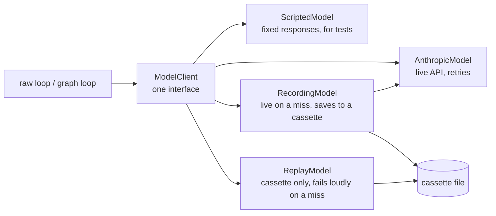

# 6. Reliability

> Part of the [learning guide](../README.md). Before this: [5. Observability & audit](05-observability-and-audit.md).

## In one sentence

Reliability is the harness surviving the real world — flaky APIs, swappable backends, duplicate
requests, races, restarts — without the agent noticing or the results changing.

## Why it matters

A model call is a network call to a busy service, and an agent makes dozens of them. Around it,
web requests repeat, people double-click, servers restart. Without care:

- **a transient 529 ("overloaded") kills a ten-minute run**;
- **retrying the wrong errors** wastes time and money on requests that can never succeed;
- **tests need the real API** — slow, costly, and different on every run;
- **a retried webhook starts the same expensive run twice**;
- **two concurrent decisions** both act — the destructive tool runs twice.

## Key terms

[model client](../glossary.md#m) · [backoff with jitter](../glossary.md#b) ·
[cassette](../glossary.md#c) · [record / replay](../glossary.md#r) · [idempotency](../glossary.md#i)

## The shape of it

Every model backend sits behind one interface, so the loop never knows which one it's using:



## Walkthrough

### 1. One interface, many backends

`opspilot/models/base.py::ModelClient` is a single method: give it the system prompt, messages
and tools, get back a normalized response (content blocks, stop reason, token usage, latency).
Four implementations:

- `opspilot/models/anthropic_model.py::AnthropicModel` — the real API.
- `opspilot/models/scripted.py::ScriptedModel` — a fixed list of responses; drives every exit
  condition in unit tests, deterministically and for free.
- `opspilot/models/recording.py::RecordingModel` and `opspilot/models/replay.py::ReplayModel` — below.

The graph loop speaks LangChain's message types instead, so an adapter,
`opspilot/models/langchain_adapter.py::ModelClientChatModel`, lets it use the same backends. One
seam means record/replay exists once, for both loops.

### 2. Retries: only what's transient, with backoff and jitter

`opspilot/models/anthropic_model.py::AnthropicModel` retries three error types — rate limited
(429), server error (500+) and overloaded (529) — up to five attempts, waiting a random,
exponentially growing time (capped at 20s) between them. Two details matter:

- **Jitter.** Without randomness, many runs that failed together retry together and trip the
  same rate limit again.
- **Fail fast on everything else.** A 400 (bad request), 401 (bad key) or 404 (unknown model) is
  a bug in *our* request; retrying wastes time and money. Those surface immediately.

The SDK's own retries are switched off (`max_retries=0`), so the two don't stack with
conflicting schedules.

Errors from *tools* follow the opposite rule — never retry, never raise: they become `ok=False`
results the model can react to (see [Tools & environment](02-tools-and-environment.md)). And in
evals, one trial's crash is recorded on that trial and never stops the sweep
(`evals/runner.py::run_trial`).

### 3. Record and replay

Real model responses are expensive and differ every time. So they're recorded once and replayed:

- A **cassette** (`opspilot/models/cassette.py::Cassette`) is a JSONL file: one line per call,
  with the request, the response and a key.
- The **key** is a hash of the request — model, system prompt, messages, tools — *after*
  masking values that change between runs but don't change meaning: random tool-call IDs, UUIDs,
  wall-clock times (`opspilot/models/cassette.py::normalize_request`). Mask too little and every
  replay misses; mask too much and real prompt changes slip through.
- **Record mode** (`opspilot/models/recording.py::RecordingModel`) serves hits from the cassette
  and only calls the API for new requests — you pay once per distinct request.
- **Replay mode** (`opspilot/models/replay.py::ReplayModel`) never touches the network. A request
  with no recording **fails loudly**, naming the first field that differs from the closest
  recorded one. Falling back to the API would make CI cost money; returning a "nearest" answer
  would test a conversation that never happened.

Because lookup is by request hash, not call order, one cassette can hold several branches of a
run — the approve path and the reject path share a prefix and then diverge.

Which mode a run uses is decided once, in `opspilot/models/factory.py::resolve_mode`: replay by
default, live or record only when asked, and never without a key. That's also what makes the
public demo cost $0 (see [Production](08-production.md)).

### 4. Exactly once: claims and idempotency

Two places where "check, then act" would break under concurrency:

- **Approvals** — two decisions racing. The fix is an atomic *claim*: set the approval to decided
  **only if it's still pending**, in one database operation. One request wins; the other is told
  who did. (Full story in [Safety & control](04-safety-and-control.md).)
- **Alerts** — a monitoring system retries a webhook. The alert's ID is claimed before any work
  (`opspilot/web/service.py::start_from_alert`); a duplicate gets the *original* run back. If
  starting the run then fails, the claim is **released**, or the sender's retry would be told
  "already handled" for a run that never existed.

The pattern generalizes: **claim atomically, then work, and undo the claim if the work fails.**

### 5. Reliable tests, too

Two lessons from this project's own test suite:

- **No real API in unit tests — enforced.** `tests/conftest.py` patches the SDK's network
  transport to raise. A default argument once made tests send real (failing) requests that still
  "passed"; now any such leak is a loud failure.
- **Wall-clock time causes flaky tests.** A record-vs-replay test compared file hashes that
  included a restart timestamp; when the two runs straddled a second boundary, it failed. The fix
  compares stable facts instead, and a test now forces the clock tick on purpose:
  `tests/evals/test_runner.py::test_record_replay_equality_survives_a_clock_tick`.

## Design decisions

- **One `ModelClient` interface.** *Alternative:* call the SDK directly from the loop — then tests
  need the network and replay needs a fake HTTP layer.
- **Hash-keyed cassettes.** *Alternative:* replay responses in recorded order — breaks on any
  branch, and hides prompt drift instead of reporting it.
- **Fail loudly on a replay miss.** *Alternative:* fall back to live — the silent cost and
  flakiness are exactly what replay exists to remove.
- **Claims in the database.** *Alternative:* a lock in the web process — useless across processes
  or instances.

## See it yourself ($0)

```bash
# A replay miss, on purpose: the operator demo recorded "approve"; answer n to reject.
uv run opspilot run --scenario checkout_pool_exhaustion --role operator
#   -> cassette miss ... first differs at .messages[8].content[0].content

# What a recorded call looks like.
head -1 evals/cassettes/demo/false_alarm-s42-viewer.jsonl | uv run python -m json.tool | head -20

# Tests: retries, record/replay, normalization, the adapter.
uv run pytest -q tests/models
```

## Check your understanding

<details><summary>The API returns 529 (overloaded) on the third call of a run. What happens?</summary>

The client waits a randomized, growing delay and retries, up to five attempts in total. If one
succeeds, the loop never knows anything happened.
</details>

<details><summary>Why isn't a 401 retried?</summary>

It means the key is wrong — a problem with our request, not a temporary condition. Retrying can
only waste time; it should fail immediately so someone fixes it.
</details>

<details><summary>You change one sentence in AGENTS.md and run the replayed evals. What happens, and why is that good?</summary>

Every request now differs from the recordings (the system prompt is part of the key), so replay
fails loudly, naming the system prompt as the first difference. A prompt change can't slip
through untested — you re-record and review the new behavior.
</details>

<details><summary>A webhook is delivered twice. How many runs start?</summary>

One. The first delivery claims the alert ID; the second finds the claim and returns the original
run instead of starting a new one.
</details>

## Further reading

- [Timeouts, retries, and backoff with jitter](https://builder.aws.com/content/3EumjoZascWd1oZiEgL8ORlv3qE/timeouts-retries-and-backoff-with-jitter) — AWS Builders' Library.
- [Exponential Backoff And Jitter](https://aws.amazon.com/blogs/architecture/exponential-backoff-and-jitter/) — AWS Architecture Blog. Why randomness beats fixed delays.
- [Claude API errors](https://platform.claude.com/docs/en/api/errors) — which status codes mean what.
- [Idempotent requests](https://docs.stripe.com/api/idempotent_requests) — Stripe. Idempotency keys, from a payments API that depends on them.
- [VCR.py](https://vcrpy.readthedocs.io/en/latest/) — the record/replay idea for HTTP, which cassettes here borrow at the model-call level.

Next: [7. Evals](07-evals.md)
