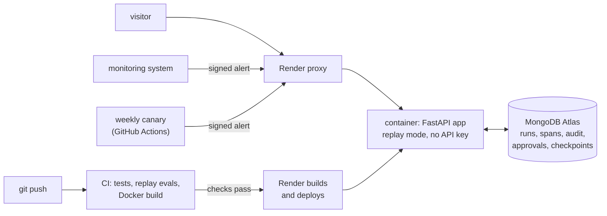

# 8. Production

> Part of the [learning guide](../README.md). Before this: [7. Evals](07-evals.md).

## In one sentence

Running an agent for other people adds a front door (a web app and a webhook), a bill to
protect, a deployment that restarts under you, and a way to know it still works.

## Why it matters

Everything so far ran on one machine, for one person. A public deployment changes the threats:

- **strangers can start runs** — and an API key behind a public URL is an open tab on the bill;
- **other systems call you** — a webhook that starts an agent must know who's calling, and cope
  with retries;
- **the host isn't yours** — free tiers sleep, restart and wipe the disk;
- **"it passed CI" isn't "it works in production"** — secrets, database, routing can each break.

## Key terms

[webhook](../glossary.md#w) · [HMAC signature](../glossary.md#h) · [idempotency](../glossary.md#i) ·
[canary](../glossary.md#c) · [outer loop](../glossary.md#o) · [record / replay](../glossary.md#r)

## The shape of it



## Walkthrough

### 1. The web app

A FastAPI app with server-rendered pages (`opspilot/web/app.py::create_app`): start a run, watch
its trace fill in, approve or reject, browse runs, metrics and the latest eval report. No
front-end build step — [htmx](https://htmx.org/docs/) re-fetches a fragment every two seconds,
and the server answers HTTP 286 when a run is done, which tells htmx to stop polling.

Behind it, `opspilot/web/service.py::WebRunService` runs each agent as a background task with its
own sandbox (`tmp/web_runs/<run_id>`), records failures on the run, and resumes paused runs from
stored state when someone approves. The same run lifecycle (`opspilot/runs.py`) serves the CLI.

### 2. Replay-first: a public demo that costs $0

The public deployment holds **no Anthropic key**. It runs in replay mode: model responses come
from recorded cassettes; tools, permissions, approvals, traces and audit all run for real. A
banner says so on every page. The start form offers only scenarios that were recorded
(`opspilot/models/factory.py::recorded_demo_paths`), and a decision that was never recorded —
rejecting where the recording approved — ends with a clear "not recorded; clone to run it live"
message instead of an error. Anyone can clone the repo and add their own key.

### 3. Cost guards, if live mode is ever turned on

For a deployment that does call the API, layers in `opspilot/web/guards.py`, cheapest first:

1. **Startup check** (`opspilot/web/guards.py::check_live_config`) — the server refuses to start
   in a spending mode unless `OPSPILOT_DEMO_LIVE=true` *and* an owner token is set. One wrong
   environment variable can't make the public site spend money.
2. **Owner token** — starting a live run requires it, compared in constant time.
3. **Daily cap** — counted in the database, so it survives restarts and spans instances.
4. **Per-run token budget** — lower for web runs (`opspilot/web/guards.py::live_run_settings`);
   the loop enforces it.
5. **Per-IP rate limit** (`opspilot/web/guards.py::RateLimiter`) — always on; replay costs no
   money but does cost CPU.

### 4. The webhook: an alert starts a run

`POST /webhooks/alert` lets a monitoring system start a run — the event-driven outer loop from
[The loop](01-loop.md). Three protections:

- **Who's calling.** The sender signs `"{timestamp}.{body}"` with a shared secret (HMAC-SHA256);
  `opspilot/web/webhooks.py::verify` checks it in constant time and rejects timestamps more than
  five minutes off, so a captured request can't be replayed later.
- **Duplicates.** Monitoring systems retry. The alert ID is claimed atomically before any work, so
  a second delivery returns the original run (see [Reliability](06-reliability.md)).
- **Routing.** A table maps `(service, signal)` to a scenario (`opspilot/web/webhooks.py::ALERT_ROUTES`);
  unknown alerts are rejected. Webhook runs use the `system` role, so destructive actions still
  wait for a human.

### 5. The canary: does production still work?

CI proves the code is right; it can't prove the deployment is (secrets set, database reachable,
webhook routed, server awake). The canary does: every Monday a GitHub Actions job sends a signed
`false_alarm` alert to the public URL and checks the run ends `completed` with root cause
`no_incident` (`scripts/canary.py::run_canary`, [`canary.yml`](../../../.github/workflows/canary.yml)).
It first wakes the server — free instances sleep after 15 idle minutes. Against the replay
deployment it costs $0. It's an eval aimed at production: a known input, a known right answer.

### 6. The deployment

- **Container** ([`Dockerfile`](../../../Dockerfile)): Python and uv pinned to the exact versions
  the tests ran on; dependencies installed from the lockfile in a cached layer; a non-root user;
  only `tmp/` writable. uvicorn trusts the proxy's forwarded headers so the rate limiter sees real
  visitor IPs — safe only because nothing but Render's proxy can reach the container.
- **Blueprint** ([`render.yaml`](../../../render.yaml)): one free web service, replay mode, a
  health check, and **deploys only after CI passes** (CI includes building this image).
- **Database**: MongoDB Atlas (free tier), with a user limited to this app's database. Render's
  free tier has no fixed outbound IP, so Atlas allows connections from anywhere — a tradeoff,
  mitigated by a strong, dedicated credential.
- **The disk is wiped** on every restart and sleep. Conversations survive in the Mongo
  checkpointer; a paused run's lost sandbox is regenerated from scenario + seed **only if the
  audit log shows nothing destructive ran yet** (`opspilot/runs.py::open_run`) — otherwise
  resuming is refused rather than run on the wrong state. Verified on the live service: pause a
  run, restart the service, approve — it completes.

## Design decisions

- **Replay by default, no key on the public server.** *Alternative:* a live demo behind rate
  limits — still a bill someone can run up. *Not offered:* "bring your own key" on the site —
  handling visitors' secrets is a burden a demo shouldn't carry.
- **Server-rendered + htmx.** *Alternative:* a JavaScript single-page app — more to build and
  host, for a UI that's mostly tables and a polled trace.
- **Signed webhook with a time window.** *Alternative:* a secret in the URL — leaks into logs and
  can be replayed forever.
- **Deploy only on green CI.** *Alternative:* deploy every commit — the build and the evals are
  the cheapest gate there is.

## See it yourself ($0)

```bash
uv run opspilot web          # the app locally, replay mode -- no key needed

# The production image, run the way Render runs it.
docker build -t opspilot . && docker run -p 10000:10000 -e OPSPILOT_STORE=memory -e OPSPILOT_MODEL=claude-haiku-4-5 opspilot

# The canary against your local server (start it with the same secret).
OPSPILOT_WEBHOOK_SECRET=local uv run opspilot web --port 8000     # terminal 1
OPSPILOT_URL=http://127.0.0.1:8000 OPSPILOT_WEBHOOK_SECRET=local uv run python scripts/canary.py   # terminal 2
```

Or open the [public demo](https://opspilot-e8ce.onrender.com) — it may take a minute to wake up.

## Check your understanding

<details><summary>Why does the public deployment have no API key at all?</summary>

Replay mode doesn't need one, and the strongest protection for a bill is not holding a key that
could be spent. Live mode stays possible, owner-only and capped, for a deployment that wants it.
</details>

<details><summary>Someone captures a valid signed webhook request and sends it again an hour later. What happens?</summary>

It's rejected: the timestamp is outside the five-minute window. (Sent again within the window, the
same alert ID would return the existing run rather than start a new one.)
</details>

<details><summary>CI is green. Why also run a canary?</summary>

CI tests the code; the canary tests the deployment — secrets, database, routing and the server
itself — against a known right answer.
</details>

<details><summary>The server restarts while a run waits for approval. What survives, and what's rebuilt?</summary>

The conversation and state survive in the Mongo checkpointer; the run record says where its sandbox
was. The sandbox files are gone, so they're regenerated from scenario + seed — allowed only because
the audit log shows no destructive action ran before the pause.
</details>

## Further reading

- [Receive Stripe events in your webhook endpoint](https://docs.stripe.com/webhooks) — Stripe. Signature checks, timestamps and retries, from a production webhook system.
- [Canarying releases](https://sre.google/workbook/canarying-releases/) — Google SRE workbook.
- [The Twelve-Factor App: Config](https://12factor.net/config) — configuration in the environment, not the code.
- [Blueprint YAML reference](https://render.com/docs/blueprint-spec) and [free instances](https://render.com/docs/free) — Render docs.
- [htmx documentation](https://htmx.org/docs/) — the polling and swapping the UI relies on.

Next: [9. Memory](09-memory.md)
