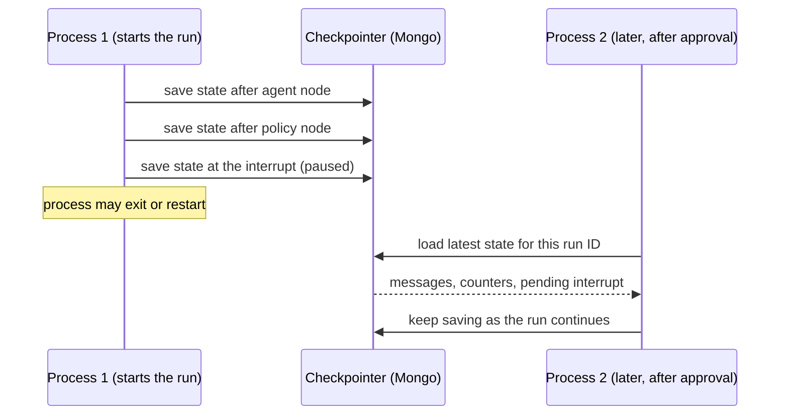

# 9. Memory

> Part of the [learning guide](../README.md). Before this: [8. Production](08-production.md).

## In one sentence

The model remembers nothing between calls; memory is whatever the harness chooses to put back in
front of it — the conversation within a run (short-term), and, later, lessons across runs
(long-term).

## Why it matters

Every API call starts from zero. If the agent seems to "remember" the logs it read three steps
ago, that's because the harness resent them. So memory is a design question:

- **what to keep** within a run — and how to survive a pause, a crash or a restart;
- **what to carry across runs** — "this symptom was a pool-size change last time";
- **what not to remember** — a wrong conclusion stored as a fact misleads every future run.

## Key terms

[short-term memory](../glossary.md#s) · [checkpointer](../glossary.md#c) ·
[context window](../glossary.md#c) · [compaction](../glossary.md#c)

## The shape of it

Short-term memory in the graph loop: the state is saved after every node, under the run's ID,
and a resume — in any process — starts from the latest save.



## Walkthrough

### 1. In the raw loop, memory is a list

`opspilot/loops/react_raw.py::run_react_loop` keeps a Python list of messages. Every turn appends
the model's reply and the tool results, and the *whole list* goes out with the next call. That
list is all the model knows — which is why input tokens grow every step
(see [Context](03-context.md)), and why it's lost the moment the process ends.

### 2. In the graph loop, memory is checkpointed state

`opspilot/loops/graph.py::AgentState` holds more than the conversation:

| Field | What it remembers |
|---|---|
| `messages` | the conversation (appended to, never replaced) |
| `step`, `tokens_used` | progress against the step cap and token budget |
| `no_tool_call_strikes`, `repeat_count`, `last_tool_signature` | what the exit rules need to remember |
| `known_services` | which services a successful read has touched (the scope check's evidence) |
| `policy_decisions`, `policy_edited_args` | the decisions for the current turn's calls |
| `outcome`, `report` | how the run ended |

After every node, the checkpointer saves this state under the run's ID
(`opspilot/loops/graph.py::build_checkpointer`): in memory for local runs, in Mongo when
`OPSPILOT_STORE=mongo`. The real numbers for a paused operator run: **12 checkpoints**, 14
messages, step 4 — and a pending interrupt waiting for a human.

### 3. Why this is what makes approvals work

A paused run isn't waiting in anyone's memory. Everything a resume needs is stored: the
conversation and counters in the checkpointer, and the run's sandbox location, model, mode and
prompt version on the run record (`opspilot/store/models.py::RunDoc`).
`opspilot/runs.py::open_run` rebuilds the run from those, and
`opspilot/loops/graph.py::resume_react_graph` continues from the latest checkpoint. That's why an
approval can come from another terminal, a restarted server, or hours later — and why it works on
a host that wipes its disk (see [Production](08-production.md)).

### 4. Records aren't memory

The store holds a lot about each run — traces, the audit log, metrics, eval results. None of it is
memory in this sense: the agent never reads it. Memory is only what goes back into the model's
context. The distinction matters for the next section, because the moment past runs *are* fed
back to the model, they start shaping its behavior.

### 5. Not built yet: long-term memory

Planned (section 4.6 of [`docs/specs/day4.md`](../../specs/day4.md)), not implemented:

- **Write only verified outcomes.** When a run completes *and* a human approved or verified it,
  store its symptoms, root cause and fix. Unverified runs aren't stored — a wrong diagnosis saved
  as fact would teach every future run the same mistake.
- **Retrieve by similarity, label as a hint.** At the start of a run, search past incidents by
  symptoms (a Mongo text index first; vector search later) and add the top few to the context as
  *"similar past incidents (may not apply)"*.
- **Measure it.** Compare memory on vs off on the golden set: steps and cost should drop, and
  accuracy must not.
- **The risk: memory poisoning.** Anything written to memory becomes part of future prompts. An
  injected instruction that gets stored could steer every later run — so only verified outcomes are
  written, and retrieved memories are framed as untrusted, like tool output.

## Design decisions

- **Checkpoint after every node.** *Alternative:* save only at pauses — a crash mid-run would lose
  everything since the last pause.
- **The run record and the checkpoint are separate.** The checkpoint is LangGraph's format for
  resuming; the run record is ours, queryable, and holds what the harness needs (sandbox location,
  mode, cassette). Each does one job.
- **Long-term memory only from verified runs.** *Alternative:* remember everything — faster to
  build, and it slowly fills memory with confident mistakes.

## See it yourself ($0)

```bash
# What the checkpointer holds for a run paused at an approval.
uv run python scripts/inspect_run.py --scenario checkout_pool_exhaustion --role operator --state

# Resume from saved state, even after deleting the sandbox (the restart test).
uv run pytest -q tests/test_runs.py
```

## Check your understanding

<details><summary>Does the model remember the logs it read in step 2 when it's on step 5?</summary>

Only because the harness resends them: the tool results from step 2 are part of the conversation,
and the whole conversation is included in every call.
</details>

<details><summary>Why can a different process approve a paused run?</summary>

The state was checkpointed to a shared store under the run's ID, and the run record says where
its sandbox is and which model and mode it used. The new process rebuilds the run from those.
</details>

<details><summary>Why aren't the traces and audit log "memory"?</summary>

The agent never sees them. Memory is only what's put back into the model's context.
</details>

<details><summary>Why store only verified outcomes in long-term memory?</summary>

A stored conclusion becomes a hint in future prompts. If it was wrong — or injected — it misleads
every run that retrieves it.
</details>

## Further reading

- [Persistence](https://docs.langchain.com/oss/python/langgraph/persistence) — LangGraph docs. Checkpoints, threads, and resuming.
- [Memory overview](https://docs.langchain.com/oss/python/concepts/memory) — LangChain docs. Short-term vs long-term memory for agents.
- [Effective context engineering for AI agents](https://www.anthropic.com/engineering/effective-context-engineering-for-ai-agents) — Anthropic. Note-taking and compaction as memory strategies.
- [MemGPT: Towards LLMs as Operating Systems](https://arxiv.org/abs/2310.08560) — Packer et al., 2023. Paging information in and out of a fixed context.
- [LLM04: Data and Model Poisoning](https://genai.owasp.org/llmrisk/llm042025-data-and-model-poisoning/) — OWASP. The risk long-term memory adds.
- [Text indexes](https://www.mongodb.com/docs/manual/core/indexes/index-types/index-text/) and [Vector Search](https://www.mongodb.com/docs/vector-search/) — MongoDB docs, for the planned retrieval.

That's the last path. Back to the [learning guide](../README.md), or the complete map in
[`CONCEPTS.md`](../../../CONCEPTS.md).
